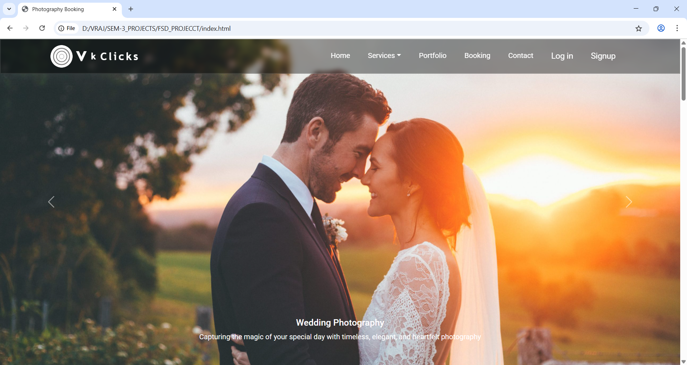

# vkclicks
Vk Clicks is a modern, user-friendly photography booking platform built for capturing memories across events like weddings, birthdays, fashion, and product shoots. Designed with a clean UI and responsive layout, it offers a seamless experience from browsing services to booking your personalized photoshoot session.

# 🚀 Features

📷 Explore Photography Services
View categorized services including:

   -  Wedding Photography

   -  Birthday Photography

   -  Fashion Photography

   -  Product Photography

- 🔍 Carousel & Visual Highlights
A dynamic homepage carousel showcasing featured photography with captions.

- 📅 Online Booking System
Book your session through a clean, secure form integrated with Web3Forms.

- 👤 User Authentication
Sign-up and log-in using modals with localStorage-based session handling.

- 💡 Responsive Design
Fully mobile-friendly, optimized for desktops as well.

- 🖼️ Portfolio Gallery
View curated work samples organized neatly using Bootstrap cards.

- 📬 Contact Form
Reach out directly through a working contact form integrated with Web3Forms.

# 🖼️ Screenshots

- 🏠 Home Page

